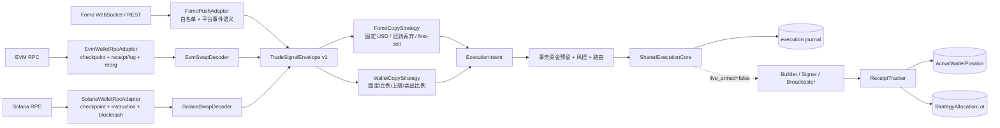

# 项目架构

## 来源隔离与共享执行边界



`SharedExecutionCore` 只接收 `ExecutionIntent`，不包含 Fomo、handle 或 KOL
平台字段。`linkedKolId` 仅用于钱包观察项的展示，不参与钱包 RPC 事件识别、
去重或卖出策略。Fomo 与钱包使用带 source namespace 的不同 signal ID。

真实执行能力必须在 capability registry 中注册并通过运行时 `self_check()`；
环境变量、任意 reference 或 `ROUTE_*_ENABLED=true` 本身不构成 implemented/ready。
最终交易安全校验解析实际序列化字节。已提供 EVM/Solana RPC 读取、系统凭据库签名、
报价、构建、模拟、广播及 receipt 适配器，但默认执行服务未注册它们；当前 0x/Jupiter
返回的交易格式尚未被严格 scope parser 完整支持，因此不得声称端到端实盘就绪。
`execution_control.live_armed` 的数据库约束仍固定为 0。签名后的交易 ID 必须在任何网络广播前写入 journal 的 `submitted` 状态；崩溃恢复只查该 ID 的 receipt，不自动重播。

## 目录职责

```text
fomo-watcher/
├─ fomo/                       # 可复用业务包
│  ├─ app.py                   # 监控应用主体
│  ├─ risk/                    # 钱包身份解析、统一信号和只读风险决策
│  ├─ intelligence/            # Fomo 行为样本、证据充分度与地址画像（不伪造 PnL）
│  ├─ execution/               # 执行意图、就绪检查、路由与 RPC 节点池
│  ├─ portfolio/               # SQLite WAL 持仓、成交、PnL 与日统计
│  └─ web/                     # 本地 HTTP API 与 static/index.html
├─ sidecar/                    # 无窗口 Privy 和 Fomo WebSocket 边车
├─ scripts/                    # 回填、维护、RPC 基准和钱包登记命令
├─ tests/                      # 单元与回归测试
├─ data/                       # 运行状态、审计流水和 SQLite 数据库（不入库）
├─ 旧文件/                     # 可恢复的历史兼容层、旧文档和旧样例
└─ run.py                      # 唯一监控启动入口
```

## 依赖方向

`risk -> execution/portfolio -> web -> app -> run.py`。业务包不会反向依赖根入口，
Privy/WebSocket 边车也不持有交易签名职责。交易秘密只允许由未来独立 signer
读取；RPC URL 只存在 `.env`，健康数据库和 API 仅保存供应商代号、延迟、成功率及高度差。
助记词可由 `scripts.wallet_vault` 写入当前操作系统用户的凭据管理器，项目文件和日志不得保存或显示它；
存入凭据不代表 signer 已启用。

Fomo refresh token 优先写入系统凭据库。旧的 `data/.fomo-session.env` 可由运维人员显式执行
`python -m scripts.secret_store_bridge migrate-session` 导入；命令不打印 token，也不会自动删除旧文件。
Windows 上凭据库不可用时不再落盘；POSIX 磁盘 fallback 必须是 0600。realtime 与 debug sidecar
共用 `data/fomo-events-writer.lock`，不能同时写入事件文件。

## 持久化边界

- `state.sqlite3`：监控去重状态。
- `portfolio.sqlite3`：模拟持仓，以及链上事实仓 `ActualWalletPosition` 与策略分配子账 `StrategyAllocationLot`。
- `execution.sqlite3`：执行状态机、原子资金预留、quote/simulation/serialized hash/receipt journal 和关闭的 live 锁。
- 执行库升级到 v7 前先经 SQLite backup API 写入同目录 `backups/execution.pre-v7.from-vN.<UTC>.sqlite3` 并做 `integrity_check`。nonce 审计表记录 acquired/bound/released；未预提交且未绑定签名交易的失败租约才会与资金预留同事务释放。v7 还保存来源 reorg fence，在预提交和广播尝试前阻断。回滚时先停止所有写入进程，核对备份 `integrity_check=ok` 与 `user_version=N`，保存当前库供审计，再用该备份还原；不可只还原 `.sqlite3` 而让旧 WAL/SHM 继续写入。
- `signal-queue.sqlite3`：Fomo Node 写入和钱包 Python 写入共享的持久化入口；单消费者租约和 source-namespaced signal ID 保证幂等。钱包 outbox 先入队、再 ack；reorg 待对账时暂停该链投递。
- `state.sqlite3`：Fomo inbox/outbox；钱包 RPC checkpoint 使用独立的 checkpoint store 契约。
- 钱包 checkpoint store：首次迁移旧库前保存经 `integrity_check` 验证的 `backups/*.pre-outbox.*.sqlite3`。checkpoint、事件 ID 和待交付 outbox 原子提交；下游持久化后按 `signal:<eventId>` 或 `reorg:<eventId>` ack。未 ack 项重启后重放。回滚时先停止写入者，再用备份还原原 SQLite 文件。
- `rpc-health.sqlite3`：RPC 样本与自动选择依据，不保存 URL。
- RPC 健康样本只证明链身份及链头探针；未证明模拟、广播或端到端执行。主备切换要验证链 ID/genesis、链头与已见区块哈希；一次性广播 RPC 失败不自动跨端点重发。
- `wallet-intelligence.sqlite3`：去重后的观察事件和行为画像输入，不保存密钥。
- `verified-performance.sqlite3`：交易哈希证明的标准化成交、历史行情、社交身份及真实钱包业绩。
- `leaderboard.sqlite3`：每小时 24H 排行快照和北京时间自然日合并名单。
- `*.ndjson`：便于人工审计和回放的追加日志。

不同数据库避免高频监控、行情写入和面板查询互相锁住。SQLite 均使用 WAL；上线服务器后，
再根据实测写入量决定是否将遥测迁移到时序数据库，无需先引入额外运维复杂度。

## 聪明钱画像边界

画像层位于事件采集和风险决策之间。第一阶段只根据 Fomo 可证明的买卖金额、入场市值、
频率、代币分散度和活跃天数描述行为，并始终标记 `pnl_unverified`。只有未来链上索引器
完成来源钱包的买卖闭环、历史价格和资金流关联后，才允许生成胜率、已实现 PnL、回撤和
“早期 Alpha”评分。画像默认 `observe_only`，不能直接授权真实交易。

链上业绩层与 Feed 行为层物理隔离。导入文件的 `sourceConfidence` 仅作审计字段，不构成验证。
只有 receipt 已验证、达到 confirmed/finalized、带可信索引器 checkpoint，且显式声明完整历史的记录
才可进入 verified 口径。系统按 FIFO 重建每个钱包/代币仓位，只有至少三个
已闭环代币才将钱包标记为 `performanceVerified`；否则胜率保持为空。峰值倍率、早期入场、峰值后
暴跌和归零反弹均来自时间有序的历史市值观测，不从当前市值反推。

## RPC 上线前流程

1. 在 `.env` 为目标链填写主、备 HTTP/WSS 地址，不要写进 YAML。
2. 运行 `python -m scripts.rpc_benchmark --samples 10`，样本写入 `data/rpc-health.sqlite3`。
3. Web 面板“持仓 / PnL”中的 RPC 节点池会显示配置数和健康数。
4. 只有每条启用链至少一个 RPC 就绪后，执行阶段才会越过 `rpc`；签名与广播仍被独立执行锁阻止。
