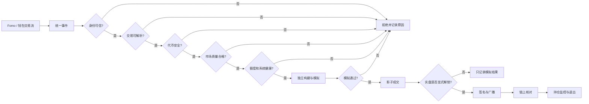

# Fomo Watcher 风控说明书

版本：v1 草案  
当前阶段：设计评审  
真实交易状态：关闭

## 1. 这套系统到底要解决什么

未来系统可能从两个地方得到跟单信号：

1. Fomo 推送的 KOL 动态或交易。
2. 已确认属于 KOL 的公开链上钱包活动。

收到信号并不等于应该交易。系统必须先回答四个问题：

- 这个钱包真的是目标 KOL 吗？
- 这笔交易真的是买入吗，买的是什么？
- 这个代币现在能够安全买入并卖出吗？
- 即使判断错误，损失是否仍被限制在可承受范围内？

只有四项全部通过，候选信号才允许进入交易构建阶段。

## 2. 为什么不能直接复制原交易

目标钱包的交易可能包含聚合器、多调用、授权、转账、任意合约调用或恶意
calldata。直接复制交易可能导致：

- 复制了与买入无关的授权或转账。
- 调用未知合约，把资金交给攻击者控制。
- KOL 的参数只适用于其自己的账户、nonce 或持仓。
- KOL 交易失败，但机器人交易独立成功。
- 原交易用了极宽滑点，复制后在更差价格成交。

因此系统只提取如下意图：

```text
目标钱包 A 想用资产 X 买入代币 Y，估算金额为 Z
```

然后使用我们审核过的 Router/Program、自己的报价和自己的限额重新构建交易。

## 3. 从信号到成交的完整流程



所有判断都必须生成明确原因。例如：

- `wallet_confidence_too_low`
- `unknown_router`
- `signal_too_old`
- `liquidity_too_low`
- `quote_divergence_too_high`
- `daily_loss_limit_reached`
- `rpc_lagging`

不允许只返回笼统的 `risk_failed`。

## 4. 钱包身份风控

钱包地址与 Twitter 用户的对应关系是第一道风控，因为错误映射会让机器人跟随完全无关的人。

每条映射至少保存：

| 字段 | 说明 |
|---|---|
| `kolId` | 系统内部稳定用户编号，不能只依赖昵称 |
| `wallet` | 链和钱包地址 |
| `evidenceType` | 签名证明、官方公布、多来源一致或行为推断 |
| `confidence` | 0 到 1 的可信度 |
| `verifiedAt` | 最近一次人工或自动验证时间 |
| `expiresAt` | 到期时间 |
| `status` | active、shadow-only、revoked |

真实交易建议只允许 `confidence >= 0.90` 的映射。行为聚类、共同入金、一次转账等证据只能用于影子观察，不能单独授权实盘。

### 示例

KOL 在其官方主页公布钱包并完成签名验证：可信度可为 `1.00`。  
第三方群聊说某地址属于 KOL：最高只记 `0.60`，只能观察。  
某地址交易时间与发帖高度吻合：属于推断证据，不足以实盘。

## 5. 信号时效

不同来源的“新鲜”含义不同：

| 来源 | 建议最大年龄 | 原因 |
|---|---:|---|
| EVM pending | 750ms | 目标是同块或下一块执行 |
| Solana preprocessed | 250ms | 原始优势只有毫秒级 |
| Solana processed | 800ms | 原交易已执行，需要快速跟随 |
| Fomo | 2000ms | 平台推送本身可能较慢 |

超过阈值不代表信息完全无价值，但不再适合自动追价，因此只记录和通知，不交易。

年龄必须从单调时钟和可信来源时间计算。系统时钟偏差超过 100ms 时自动熔断，以免把旧信号判断为新信号。

## 6. 代币安全检查

### EVM 代币

至少检查：

- 合约代码存在且目标链正确。
- 是否为代理合约，当前实现是否刚变化。
- 是否可暂停、黑名单、任意增发或修改税率。
- 买入税和卖出税是否超过阈值。
- 是否能够通过小额卖出模拟。
- Router、函数 selector 和内部调用目标是否在允许名单。
- 是否包含 delegatecall 或无法解释的多调用。

### Solana 代币

至少检查：

- Mint、Token Program 和池子账户所有者正确。
- mint authority、freeze authority 是否仍可用。
- Token-2022 transfer hook、transfer fee 等扩展是否存在。
- 交易涉及的 Program ID 和 CPI 是否全部在允许名单。
- Address Lookup Table 是否异常或刚被修改。
- 是否存在可用卖出路径。

任一关键字段无法确认时必须拒绝，而不是假设安全。

## 7. 市场质量和报价

通过两个独立报价来源进行交叉验证：

- 报价年龄不能超过 750ms。
- 两个报价的预期输出差异不能超过 1%。
- 本次交易的价格冲击不能超过 1%。
- 允许滑点上限为 1.5%。
- 流动性建议不低于 100,000 USD。

这里的流动性阈值不是代币市值。高市值代币也可能只有很浅的可交易池。

如果只有一个报价源、报价超时或两个来源明显不一致，信号进入 `defer/reject`，不能为了速度绕过检查。

## 8. 资金与敞口

初始 canary 参数：

| 限制 | 默认值 |
|---|---:|
| 单笔真实买入 | 10 USD |
| 单 token 总敞口 | 20 USD |
| 单 KOL 每日投入 | 50 USD |
| 全局每日投入 | 100 USD |
| 最大同时持仓 | 5 |
| 单链占总额度 | 50% |
| 日内已实现亏损熔断 | 20 USD |

额度计算必须包含已提交但尚未确认的交易，避免两条并发信号同时通过检查后突破限额。

## 9. 系统健康风控

交易判断正确，基础设施异常仍可能造成损失。以下情况必须停止新买入：

- Fomo、mempool 或 Solana 数据流断开。
- 钱包关注白名单过期或加载失败。
- 本机时钟偏差超过 100ms。
- EVM RPC 落后超过 1 个区块。
- Solana RPC 落后超过 2 个 slot。
- 两个 RPC 返回的链高度、nonce、余额或报价矛盾。
- 连续 3 次交易执行失败。
- 最近 10 分钟交易失败率超过 20%。
- gas/SOL reserve 低于安全值。

熔断状态必须落盘。程序重启不能自动恢复，必须由操作员查看原因并手动解锁。

## 10. 为什么买入前必须有退出方案

“能买到”不代表“能卖掉”。每次买入前必须创建退出计划，至少包括：

- 实际成交价基础上的 8% 硬止损。
- 默认 30 分钟最大持仓时间。
- KOL 卖出时按比例减仓。
- 流动性或权限异常时停止加仓。
- 自动卖出失败时立即通知并锁定该 token。

止损不是保证成交价格。在流动性骤降或合约限制卖出的情况下，实际损失可能超过 8%，所以单笔和总敞口限制仍然不可缺少。

## 11. Shadow、Paper 和 Live 的区别

| 模式 | 行为 |
|---|---|
| Shadow | 根据实时信号做判断，不请求真实报价、不签名 |
| Paper | 请求真实报价并模拟构建，记录假设成交结果，不广播 |
| Live | 使用真实钱包签名和广播，产生真实资产变化 |

系统必须按照 `Shadow -> Paper -> Canary Live -> Expanded Live` 顺序升级，不能从 Shadow 直接切换为大额 Live。

## 12. 真实交易解锁

仅修改配置文件不能开启真实交易。建议同时要求：

1. `liveTrading.enabled=true`。
2. 进程启动时提供一次性 `--arm-live` 参数。
3. 当前签名钱包处于允许名单。
4. 风控策略版本已审核并记录哈希。
5. 退出执行器处于健康状态。
6. 所有熔断器处于正常状态。

任一条件消失立即退回只读/影子模式。

## 13. 当前结论

现阶段应该继续收集钱包信号并做影子比较，而不是开始真实交易。最有价值的数据是：

- 钱包监听比 Fomo 平均提前多少。
- 不同链和数据源的 P50/P95/P99 信号年龄。
- 模拟成交相对 KOL 成交价的滑点。
- 扣除 gas、priority fee、Jito/发送器 tip 后的净结果。
- 原交易失败而候选跟单信号出现的比例。

这些数据将决定真实交易是否有统计优势，也决定哪些风控阈值需要调整。

